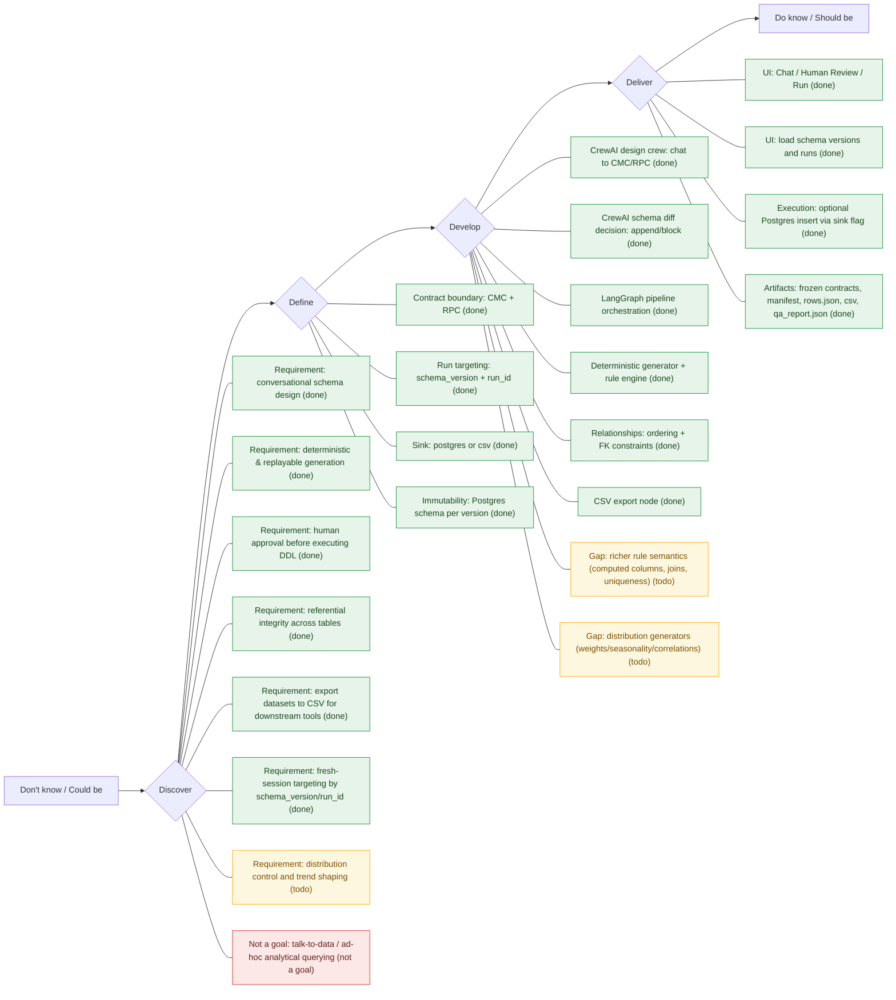

# Double Diamond Design Thinking – Synthetic Data Factory

## Problem Statement
Design an agentic platform that lets users co‑design schemas with a crew, generate synthetic datasets, and safely evolve structure while preserving data integrity.

---

## Executive Summary
This project is a contract‑driven synthetic data factory that combines conversational schema design (CrewAI), deterministic orchestration (LangGraph), and Postgres schema versioning. The current implementation supports chat‑based proposal generation, contract freezing, GenAI schema‑diff decisions against Postgres, human DDL approval, deterministic row generation driven by RPC rules/value domains, bulk inserts into Postgres, and QA reporting (rule checks + value domains + referential integrity). Token usage is kept low by confining LLM calls to conversational design and the schema‑diff decision, while data generation, insertion, and QA are deterministic. The primary remaining gaps are richer rule semantics (joins, computed columns, uniqueness) and explicit distribution/trend control.

---

## Double Diamond Overview
The Double Diamond has four phases:
1) Discover → explore the problem space  
2) Define → converge on a clear problem statement and requirements  
3) Develop → ideate and prototype solutions  
4) Deliver → validate and ship a working system

---

## Double Diamond Diagram (Current)

## 1) Discover (Divergent)
**Goal:** Understand user needs, data integrity concerns, and operational constraints.

**Key Questions**
- What does “designable schema” mean across domains?
- What integrity constraints must hold across runs and schema changes?
- What level of human approval is required at each stage?
- What are the database constraints and operational environments?

**Business Requirements (Status)**
- Completed
  - Conversational schema design that is domain/schema agnostic (chat → CMC/RPC).
  - Deterministic, replayable pipeline (same frozen contracts ⇒ same DDL + data).
  - Safe execution: human approval gate before applying DDL.
  - Referential integrity across multi-table schemas (CMC relationships → FK + generation + QA).
  - Fresh-session targeting: load an existing schema version or run to continue a specific lineage.
  - Export datasets as CSV artifacts for downstream vendor tools.
- Not yet taken up
  - Data distribution control and trend shaping (seasonality, skew, correlations, event spikes) via an explicit distribution spec in RPC.
  - Richer rule semantics beyond equals/prefix/value_domains (computed columns, joins, uniqueness).
- Explicitly not a goal
  - Talk-to-data / ad-hoc analytical querying of existing DB contents via chat.

| Requirement | Status | What it means | Current handling |
|---|---|---|---|
| Conversational schema design (chat → CMC/RPC) | Done | Users describe a domain in chat; the system outputs a schema (CMC) and rules (RPC). | Implemented via CrewAI in `/chat`; results can be frozen into versioned contracts. |
| Deterministic, replayable pipeline | Done | Same frozen contracts + params produce the same DDL + data. | Seeded generation and contract-driven pipeline; artifacts saved per run. |
| Human approval gate before DDL | Done | Pipeline pauses before executing any DDL; a human must explicitly approve. | UI shows DDL preview and requires “Approve DDL” before continuing. |
| Referential integrity for multi-table schemas | Done | Child tables reference parent keys consistently (FK-aware generation + checks). | CMC relationships generate FK constraints; generation samples parent key pools; QA checks FK membership. |
| Fresh-session targeting by schema_version/run_id | Done | A new UI session can explicitly pick which lineage/version to continue. | UI can load frozen contracts or resume an existing run; API exposes `/versions` and `/runs`. |
| Export datasets to CSV | Done | Generated datasets can be consumed by external tools as CSV files. | Pipeline writes `artifacts/runs/<run_id>/csv/<table>.csv` and exposes paths in run status. |
| Distribution control and trend shaping | Todo | Ability to enforce realistic marginals/correlations/seasonality (not just valid values). | Not implemented; would be an RPC “distribution spec” + generator extensions. |
| Richer rule semantics (computed columns/joins/uniqueness) | Todo | Express and enforce complex rules beyond equals/prefix and simple domains. | Not implemented; would extend RPC rule types + QA. |
| Talk-to-data / ad-hoc analytical querying | Not a goal | Chat over the contents of the DB for analysis or Q&A. | Out of scope; system focuses on synthetic generation, not analytics. |

**Insights Mapped to Current Code**
- Conversational schema design with multiple roles to explore the problem space.  
  - [crew.py](file:///c:/Users/PrachiMore/Documents/trae_projects/Synthetic%20Data%20Fac/app/crewai/crew.py)
- Contract abstraction (CMC/RPC) to stay domain‑agnostic.  
  - [main.py](file:///c:/Users/PrachiMore/Documents/trae_projects/Synthetic%20Data%20Fac/app/api/main.py#L44-L100)

---

## 2) Define (Convergent)
**Goal:** Lock requirements, constraints, and success criteria.

**Defined Requirements**
- Contract‑driven schemas (CMC/RPC)  
- Immutable versions (schema per run)  
- Human approval gates  
- Deterministic build pipeline  
- Integrity‑first handling of schema diffs

**What the Current Code Covers**
- Frozen versioned contracts and artifacts.  
  - [main.py](file:///c:/Users/PrachiMore/Documents/trae_projects/Synthetic%20Data%20Fac/app/api/main.py#L174-L205)
- Versioned schema naming (`synthetic_000N`).  
  - [main.py](file:///c:/Users/PrachiMore/Documents/trae_projects/Synthetic%20Data%20Fac/app/api/main.py#L207-L235)
- Human approval gate for DDL.  
  - [main.py](file:///c:/Users/PrachiMore/Documents/trae_projects/Synthetic%20Data%20Fac/app/api/main.py#L259-L266)
- Run/version discovery endpoints to support fresh-session continuation.  
  - [main.py](file:///c:/Users/PrachiMore/Documents/trae_projects/Synthetic%20Data%20Fac/app/api/main.py)

---

## 3) Develop (Divergent)
**Goal:** Prototype workflows, agentic decisions, and integrity checks.

**Prototype Elements**
- CrewAI crew implementation for chat-driven schema/rule proposals
- LangGraph orchestration of build steps  
- CrewAI schema‑diff decision node (append/block)
- DDL emission for Postgres (including FK constraints)  
- Deterministic row generation driven by RPC rules/value domains  
- Referential integrity support via CMC relationships
- CSV export artifacts per run (sink selectable)

**What the Current Code Covers**
- Agentic workflow with schema diff decision.  
  - [graph.py](file:///c:/Users/PrachiMore/Documents/trae_projects/Synthetic%20Data%20Fac/app/graph/graph.py)  
  - [decide.py](file:///c:/Users/PrachiMore/Documents/trae_projects/Synthetic%20Data%20Fac/app/graph/nodes/decide.py)
- CrewAI-based proposal generation for contracts.  
  - [crew.py](file:///c:/Users/PrachiMore/Documents/trae_projects/Synthetic%20Data%20Fac/app/crewai/crew.py)
- Postgres DDL emission and schema creation.  
  - [emit_ddl.py](file:///c:/Users/PrachiMore/Documents/trae_projects/Synthetic%20Data%20Fac/app/graph/nodes/emit_ddl.py)
- Schema inspection using Postgres system catalogs.  
  - [postgres_io.py](file:///c:/Users/PrachiMore/Documents/trae_projects/Synthetic%20Data%20Fac/app/db/postgres_io.py)
- Relationship parsing, table ordering, and FK DDL.  
  - [relationships.py](file:///c:/Users/PrachiMore/Documents/trae_projects/Synthetic%20Data%20Fac/app/relationships.py)
- Rule parsing and deterministic application during generation.  
  - [rules.py](file:///c:/Users/PrachiMore/Documents/trae_projects/Synthetic%20Data%20Fac/app/rules.py)
- UI workflow to preview proposal, freeze, run, and approve DDL.  
  - [streamlit_app.py](file:///c:/Users/PrachiMore/Documents/trae_projects/Synthetic%20Data%20Fac/app/ui/streamlit_app.py)
- CSV export per run.  
  - [export_csv.py](file:///c:/Users/PrachiMore/Documents/trae_projects/Synthetic%20Data%20Fac/app/graph/nodes/export_csv.py)

---

## 4) Deliver (Convergent)
**Goal:** Provide a usable system that can be validated, iterated, and extended.

**Current Delivery State**
- End‑to‑end conversational flow from schema design → freeze → run  
- Fresh-session targeting by loading a schema version or run identifier  
- GenAI schema diff decision before DDL execution  
- Human DDL approval gate  
- Postgres‑backed schema namespaces for versioning  
- Deterministic row generation and optional inserts into Postgres (`sink=postgres`)  
- CSV exports written per run (`sink=csv` or `sink=postgres`)  
- QA report with rule/value-domain/relationship integrity validation  
- Run artifacts persisted for lineage

**What Is Not Yet Implemented (Next Deliverables)**
- Expanded rule semantics and distributions (computed columns, correlations, seasonality).

---

## Roadmap (Next 3 Iterations)
1) **Data integrity MVP**
   - Expand rule coverage (uniqueness, computed columns, joins)  
   - Improve QA reporting (more precise rule violations)  
2) **Schema evolution**
   - Improve schema diff summaries and user-facing decision explanations  
3) **Agentic quality**
   - Add tool‑backed contract linting and schema validation  
   - Add diff explanations and user‑facing decision summaries  

---

## Summary Mapping (Phase → Code)
- **Discover:** Business requirements capture (conversational design, determinism, approvals, export needs)  
- **Define:** CMC/RPC contracts, run targeting, sink policy, freeze/versioning, approval gate  
  - [main.py](file:///c:/Users/PrachiMore/Documents/trae_projects/Synthetic%20Data%20Fac/app/api/main.py)
- **Develop:** CrewAI crew + schema diff decision, LangGraph orchestration, Postgres DDL, rule + relationship support, CSV export  
  - [crew.py](file:///c:/Users/PrachiMore/Documents/trae_projects/Synthetic%20Data%20Fac/app/crewai/crew.py)
  - [graph.py](file:///c:/Users/PrachiMore/Documents/trae_projects/Synthetic%20Data%20Fac/app/graph/graph.py)  
  - [decide.py](file:///c:/Users/PrachiMore/Documents/trae_projects/Synthetic%20Data%20Fac/app/graph/nodes/decide.py)  
  - [emit_ddl.py](file:///c:/Users/PrachiMore/Documents/trae_projects/Synthetic%20Data%20Fac/app/graph/nodes/emit_ddl.py)  
  - [rules.py](file:///c:/Users/PrachiMore/Documents/trae_projects/Synthetic%20Data%20Fac/app/rules.py)  
  - [relationships.py](file:///c:/Users/PrachiMore/Documents/trae_projects/Synthetic%20Data%20Fac/app/relationships.py)
- **Deliver:** UI + API integration, run execution, artifact persistence  
  - [streamlit_app.py](file:///c:/Users/PrachiMore/Documents/trae_projects/Synthetic%20Data%20Fac/app/ui/streamlit_app.py)  
  - [main.py](file:///c:/Users/PrachiMore/Documents/trae_projects/Synthetic%20Data%20Fac/app/api/main.py)  
  - [generate.py](file:///c:/Users/PrachiMore/Documents/trae_projects/Synthetic%20Data%20Fac/app/graph/nodes/generate.py)  
  - [insert.py](file:///c:/Users/PrachiMore/Documents/trae_projects/Synthetic%20Data%20Fac/app/graph/nodes/insert.py)  
  - [export_csv.py](file:///c:/Users/PrachiMore/Documents/trae_projects/Synthetic%20Data%20Fac/app/graph/nodes/export_csv.py)
  - [qa.py](file:///c:/Users/PrachiMore/Documents/trae_projects/Synthetic%20Data%20Fac/app/graph/nodes/qa.py)
