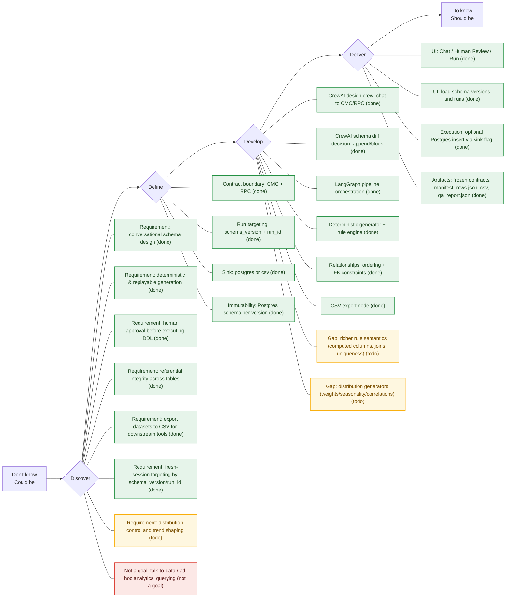

# Double Diamond Diagram (Mermaid)

Paste this into https://mermaid.live to view/export.

```mermaid
flowchart LR
  A["Don't know<br/>Could be"] --> D1{Discover}
  D1 --> D2{Define}
  D2 --> D3{Develop}
  D3 --> D4{Deliver}
  D4 --> B["Do know<br/>Should be"]

  D1 --- d1a["Requirement: conversational schema design (done)"]
  D1 --- d1b["Requirement: deterministic & replayable generation (done)"]
  D1 --- d1c["Requirement: human approval before executing DDL (done)"]
  D1 --- d1d["Requirement: referential integrity across tables (done)"]
  D1 --- d1e["Requirement: export datasets to CSV for downstream tools (done)"]
  D1 --- d1f["Requirement: fresh-session targeting by schema_version/run_id (done)"]
  D1 --- d1g["Requirement: distribution control and trend shaping (todo)"]
  D1 --- d1h["Not a goal: talk-to-data / ad-hoc analytical querying (not a goal)"]

  D2 --- d2a["Contract boundary: CMC + RPC (done)"]
  D2 --- d2b["Run targeting: schema_version + run_id (done)"]
  D2 --- d2c["Sink: postgres or csv (done)"]
  D2 --- d2d["Immutability: Postgres schema per version (done)"]

  D3 --- d3a["CrewAI design crew: chat to CMC/RPC (done)"]
  D3 --- d3b["CrewAI schema diff decision: append/block (done)"]
  D3 --- d3c["LangGraph pipeline orchestration (done)"]
  D3 --- d3d["Deterministic generator + rule engine (done)"]
  D3 --- d3e["Relationships: ordering + FK constraints (done)"]
  D3 --- d3f["CSV export node (done)"]
  D3 --- d3g["Gap: richer rule semantics (computed columns, joins, uniqueness) (todo)"]
  D3 --- d3h["Gap: distribution generators (weights/seasonality/correlations) (todo)"]

  D4 --- d4a["UI: Chat / Human Review / Run (done)"]
  D4 --- d4b["UI: load schema versions and runs (done)"]
  D4 --- d4c["Execution: optional Postgres insert via sink flag (done)"]
  D4 --- d4d["Artifacts: frozen contracts, manifest, rows.json, csv, qa_report.json (done)"]

  classDef done fill:#E6F4EA,stroke:#1E8E3E,color:#1E4620;
  classDef todo fill:#FEF7E0,stroke:#F9AB00,color:#7A4F01;
  classDef nogo fill:#FCE8E6,stroke:#D93025,color:#5F2120;

  class d1a,d1b,d1c,d1d,d1e,d1f done;
  class d1g,d3g,d3h todo;
  class d1h nogo;

  class d2a,d2b,d2c,d2d done;

  class d3a,d3b,d3c,d3d,d3e,d3f done;

  class d4a,d4b,d4c,d4d done;
```

